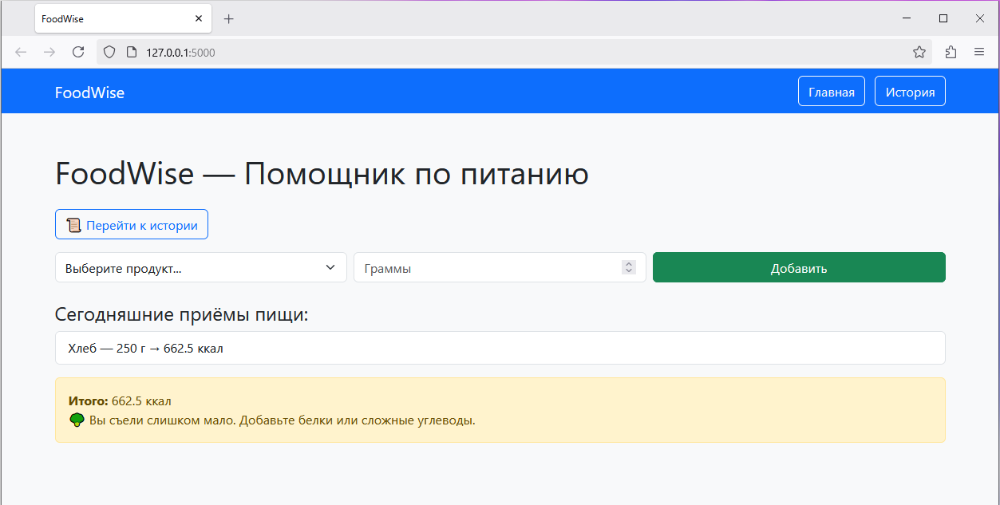
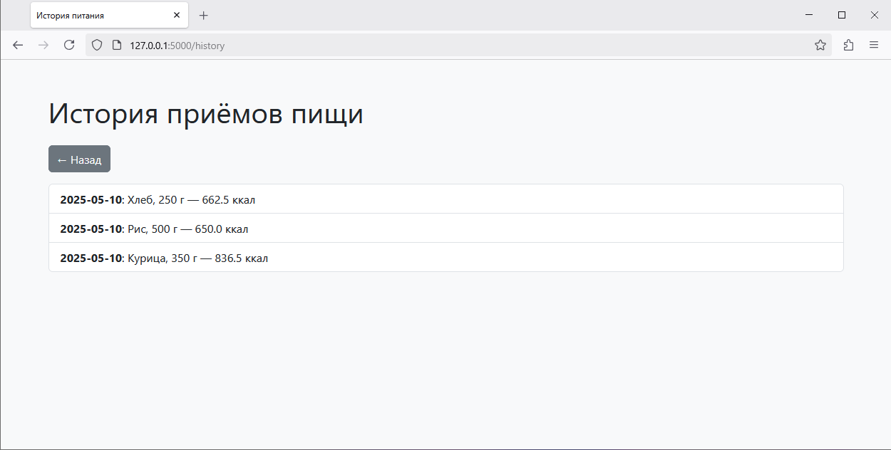

# 🔧 FoodWise — помощник по питанию и подсчету калорий

FoodWise — это простое веб-приложение для подсчёта калорий и анализа питания. Пользователь выбирает продукт, указывает количество в граммах — система автоматически считает калории и даёт рекомендации.

## 👥 Команда проекта

 - Климова Екатерина Даниловна (@katerinakli77), ЭУ-201
 - Поклад Владимир Дмитриевич (@Pine-T), ЭУ-201
 - Рубинштейн Андрей Александрович (@rubye13), ЭУ-201

## 📄 Финальная документация проекта "FoodWise"

### [Техническое задание.md](/Техническое%20задание.md)

### 🚀 Запуск проекта

1. Установите зависимости:

```
pip install -r requirements.txt
```

2. Запустите приложение:

```
python app.py
```

3. Перейдите в браузер: `http://127.0.0.1:5000/`

---

### 🧪 Внешний вид

#### Главная страница



#### История



---

### ⚙️ Используемые технологии

- Python==3.11.2
- Flask==3.1.0
- SQLite
- Bootstrap 5

---

### 📁 Структура проекта

```
tcia/
├── .gitignore
├── app.py
├── requirements.txt
├── images/
│   ├── Основная.png
│   └── История.png
├── Документация.md
├── Тестирование.md
```

---

### ✅ Возможности

- [x] Подсчёт калорий на основе продукта и веса
- [x] История приёмов пищи
- [x] Рекомендации по калориям
- [x] Удобный интерфейс с Bootstrap
- [x] Навигация между страницами
