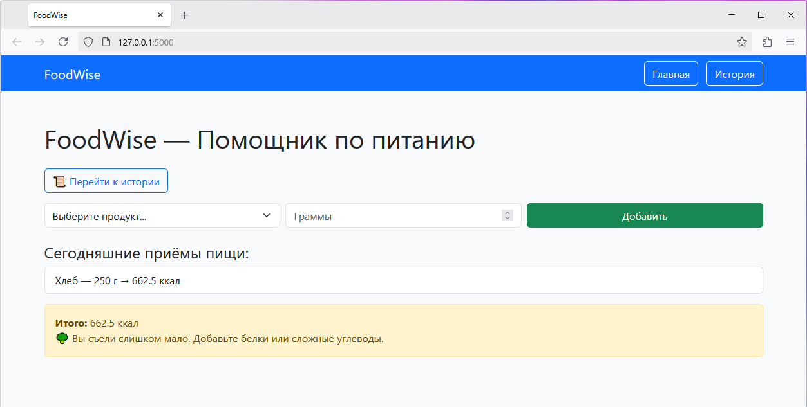
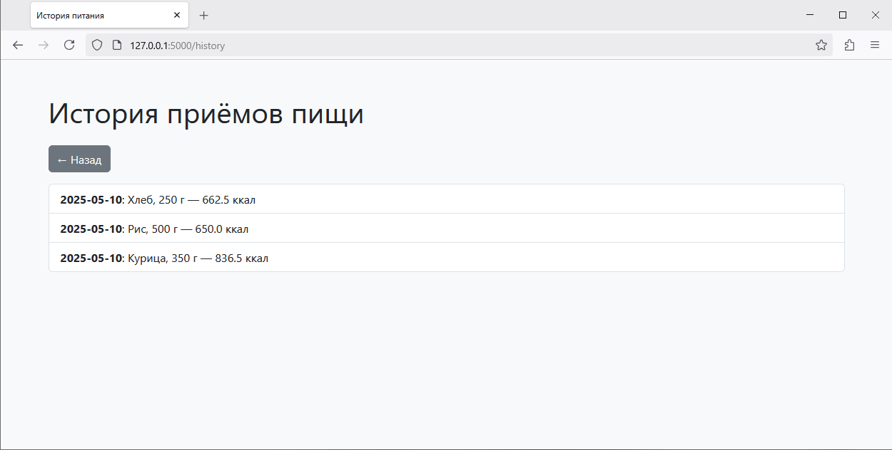

# 📦 Финальная документация проекта "FoodWise"

## 🚀 Запуск проекта

1. Установите зависимости:

```
pip install -r requirements.txt
```

2. Запустите приложение:

```
python app.py
```

3. Перейдите в браузер: `http://127.0.0.1:5000/`

---

## 🧪 Внешний вид

### Главная страница



### История



---

## ⚙️ Используемые технологии

- Python==3.11.2
- Flask==3.1.0
- SQLite
- Bootstrap 5

---

## 📁 Структура проекта

```
tcia/
├── .gitignore
├── app.py
├── requirements.txt
├── images/
│   ├── Основная.png
│   └── История.png
├── Документация.md
├── Тест-кейсы.md
```

---

## ✅ Возможности

- [x] Подсчёт калорий на основе продукта и веса
- [x] История приёмов пищи
- [x] Рекомендации по калориям
- [x] Удобный интерфейс с Bootstrap
- [x] Навигация между страницами
